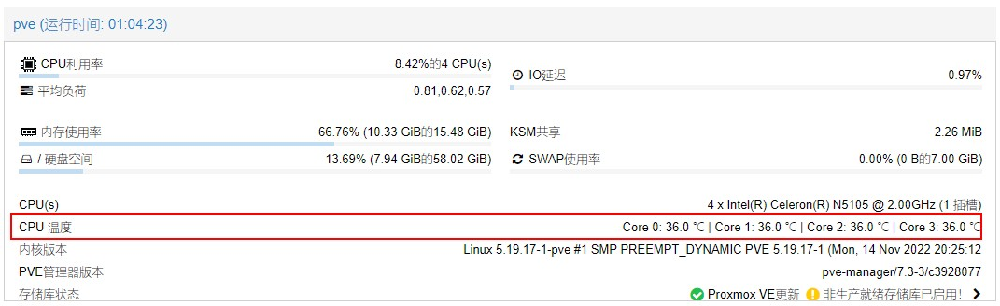

<!-- # 添加CPU温度显示 -->
效果图：



## 1.安装lm-sensors
```bash
apt install lm-sensors
```
## 1.1 查看sensors
```bash
root@pve:~# sensors
coretemp-isa-0000
Adapter: ISA adapter
Package id 0:  +37.0°C  (high = +105.0°C, crit = +105.0°C)
Core 0:        +34.0°C  (high = +105.0°C, crit = +105.0°C)
Core 1:        +34.0°C  (high = +105.0°C, crit = +105.0°C)
Core 2:        +34.0°C  (high = +105.0°C, crit = +105.0°C)
Core 3:        +34.0°C  (high = +105.0°C, crit = +105.0°C)

acpitz-acpi-0
Adapter: ACPI interface
temp1:        +27.8°C  (crit = +119.0°C)

nvme-pci-0100
Adapter: PCI adapter
Composite:    +41.9°C  (low  = -273.1°C, high = +81.8°C)
                       (crit = +84.8°C)
Sensor 1:     +41.9°C  (low  = -273.1°C, high = +65261.8°C)
```

# 2. 修改文件
## 2.1 /usr/share/perl5/PVE/API2/Nodes.pm

搜索 my $dinfo = df('/',1)
如下：
```bash
	$res->{pveversion} = PVE::pvecfg::package() . "/" .
	    PVE::pvecfg::version_text();
	
	my $dinfo = df('/', 1);     # output is bytes
```

 在my $dinfo之前添加
 ` $res->{thermalstate}='sensors';`
 如下：
```bash
		$res->{pveversion} = PVE::pvecfg::package() . "/" .
	    PVE::pvecfg::version_text();
	
	##Add temperature
	$res->{thermalstate} = `sensors`;
  
	my $dinfo = df('/', 1);     # output is bytes
  ```
  
## 2.2 /usr/share/pve-manager/js/pvemanagerlib.js
### 2.2.1搜索 ` PVE.panel.StatusView` 将`height`修为`320`
如下：
```bash
Ext.define('PVE.panel.GuestStatusView', {
    extend: 'Proxmox.panel.StatusView',
    alias: 'widget.pveGuestStatusView',
	
	height:320,
	bodyPadding:'20 15 20 15',
    mixins: ['Proxmox.Mixin.CBind'],

    cbindData: function(initialConfig) {
	var me = this;
	return {
	    isQemu: me.pveSelNode.data.type === 'qemu',
	    isLxc: me.pveSelNode.data.type === 'lxc',
	};
    },
```
### 2.2.2 往下找到items-->`Cpu(s)`，并在后面添加一个items
如下：
```bash
{       
		itemId: 'thermal',
		colspan: 2,
		printBar: false,
		title: gettext('CPU 温度'),
		textField: 'thermalstate',
		renderer:function(value){
			const c0 = value.match(/Core 0.*?\+([\d\.]+)Â/)[1];
			const c1 = value.match(/Core 1.*?\+([\d\.]+)Â/)[1];
			const c2 = value.match(/Core 2.*?\+([\d\.]+)Â/)[1];
			const c3 = value.match(/Core 3.*?\+([\d\.]+)Â/)[1];
			return `Core 0: ${c0} &#8451 | Core 1: ${c1} ℃ | Core 2: ${c2} ℃ | Core 3: ${c3} ℃`
            }
		},
```
# 3.重启PVE web 服务
```bash
systemctl restart pveproxy
```
  